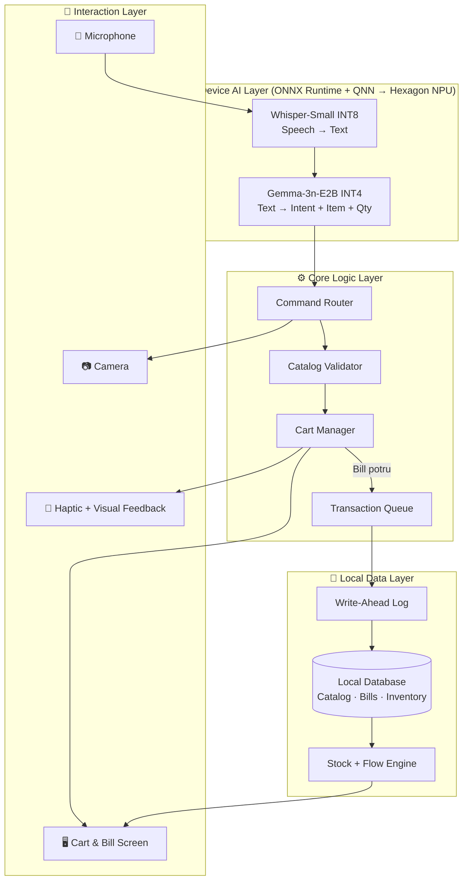
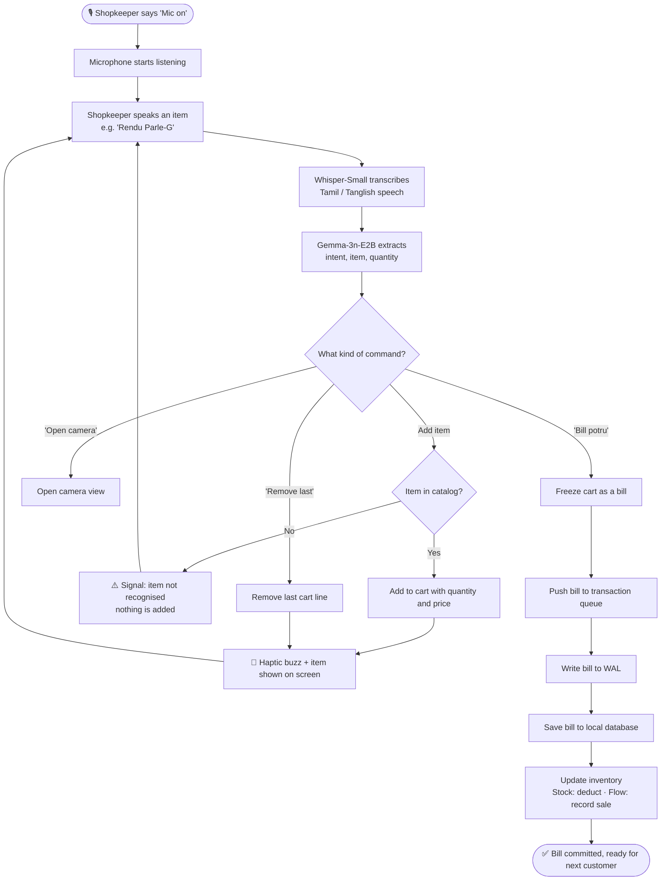
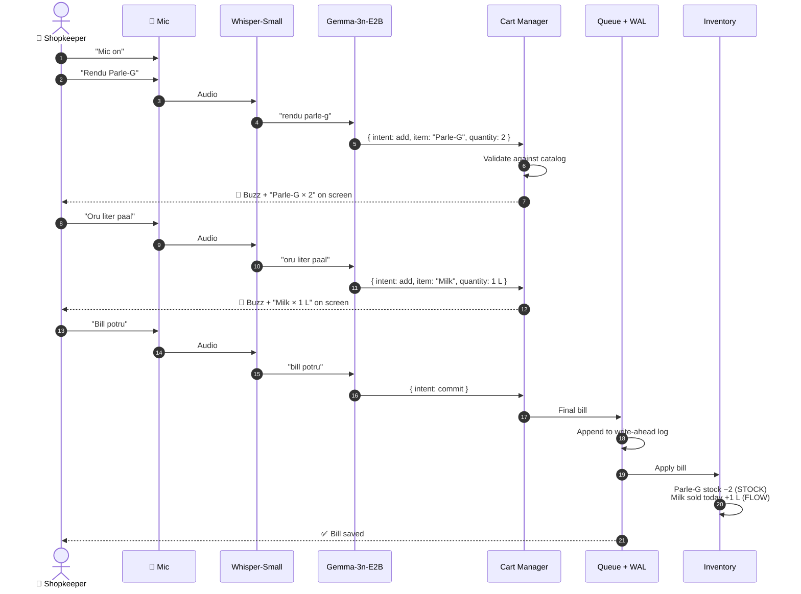
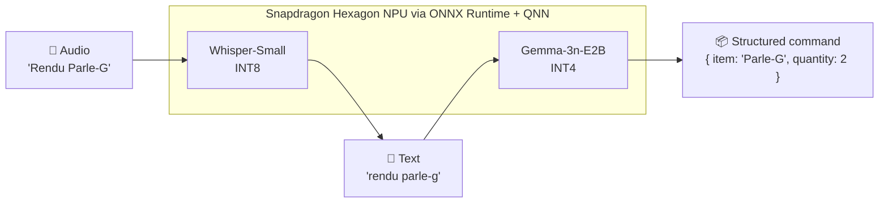
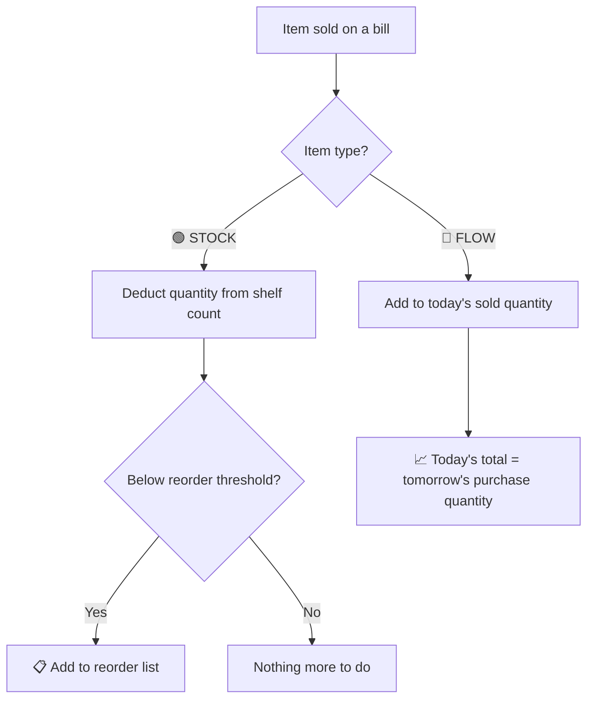
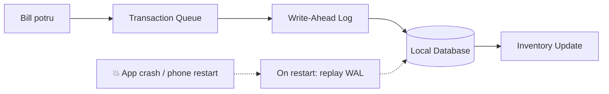

<div align="center">

# 🛒 KiranaFlow

### Voice-first, hands-free billing and inventory for local kirana shops


</div>

---

## 📑 Table of Contents

1. [Overview](#-overview)
2. [The Problem](#-the-problem)
3. [Our Solution](#-our-solution)
4. [System Architecture](#%EF%B8%8F-system-architecture)
5. [End-to-End System Flow](#-end-to-end-system-flow)
6. [Voice Commands](#%EF%B8%8F-voice-commands)
7. [On-Device AI Pipeline](#-on-device-ai-pipeline)
8. [Dual Inventory: Stock + Flow](#-dual-inventory-stock--flow)
9. [Reliability: Queue + WAL Recovery](#%EF%B8%8F-reliability-queue--wal-recovery)
10. [Tech Stack](#-tech-stack)
11. [Problem → Solution Map](#-problem--solution-map)
12. [Team](#-team-mavericks)

---

## 📌 Overview

KiranaFlow is an **offline-first, voice-powered POS** for kirana shop owners.

The shopkeeper speaks in Tamil or Tanglish, the phone understands what was said, checks the item against the shop's catalog, adds it to the bill, and updates inventory. All AI runs on the phone itself, so it works with no internet connection, no barcode scanner, and no separate POS machine.

| | |
|---|---|
| **Input** | Natural voice in Tamil / Tanglish |
| **Hardware** | One Android smartphone |
| **Internet** | Not required |
| **AI** | Whisper-Small (speech) + Gemma-3n-E2B (understanding), on-device |
| **Inventory** | Stock items (counted) and Flow items (sold fresh daily) |

---

## 🚨 The Problem

Most kirana shops run on mental math, paper notebooks, and memory. Existing POS software doesn't fit the counter:

| Pain point | What happens at the counter |
|---|---|
| ⌨️ Typing and scanning | Billing slows down during rush hour and queues build up |
| 🌐 Cloud dependency | The system stops working when the network drops |
| 💰 Extra hardware | Scanners and POS terminals cost money most shops won't spend |
| 🗣️ English-first menus | Hard to use for shopkeepers who think and speak in Tamil |
| 📱 Screen-heavy workflows | Hands are needed for products, cash, and bags, not the phone |
| 📦 One-size inventory | Milk and eggs don't behave like soap and biscuits |

So shopkeepers go back to notebooks. They end up with no clear view of stock and no digital record to plan purchases from.

---

## 💡 Our Solution

KiranaFlow lets the shopkeeper bill by talking. The phone stays on the counter and does the rest.

```
   🎙️ Speak  ──▶  🧠 Understand  ──▶  ✅ Confirm  ──▶  💾 Commit
```

- **No typing.** Items are added by voice.
- **No scanner.** The catalog lives on the phone.
- **No POS terminal.** Any supported Android phone works.
- **No internet needed.** Speech and language models run locally.

---

## 🏗️ System Architecture

KiranaFlow is organised into four layers, all running on the device.



| Layer | Responsibility |
|---|---|
| **Interaction** | Captures voice, shows the cart, gives haptic and visual confirmation |
| **On-Device AI** | Turns speech into text, then text into a structured command |
| **Core Logic** | Routes commands, validates items against the catalog, manages the cart, queues bills |
| **Local Data** | Stores the catalog, bills, and inventory; protects every committed bill with a write-ahead log |

---

## 🔄 End-to-End System Flow

### 1. The full billing loop



### 2. One bill, step by step



### 3. What each stage does

| # | Stage | Input | Output |
|---|---|---|---|
| 1 | **Listen** | "Mic on" | Microphone active |
| 2 | **Transcribe** | Tamil / Tanglish audio | Text, e.g. `rendu parle-g` |
| 3 | **Understand** | Text | `{ intent, item, quantity }` |
| 4 | **Validate** | Parsed item | Matched catalog product, or a "not recognised" signal |
| 5 | **Update cart** | Valid item | Cart line added or removed |
| 6 | **Confirm** | Cart change | Haptic buzz + on-screen line |
| 7 | **Commit** | "Bill potru" | Bill queued and written to WAL |
| 8 | **Persist** | WAL entry | Bill saved in local database |
| 9 | **Update inventory** | Saved bill | Stock deducted or Flow sales recorded |

---

## 🗣️ Voice Commands

| Say this | Meaning | What happens |
|---|---|---|
| `Mic on` | Start listening | Microphone turns on |
| `Rendu Parle-G` | Two Parle-G | Adds Parle-G × 2 to the cart |
| `Dettol soap` | One Dettol soap | Adds Dettol soap × 1 |
| `Oru liter paal` | One litre of milk | Adds Milk × 1 L |
| `Remove last` | Undo | Removes the last item added |
| `Open camera` | Camera | Opens the camera view |
| `Bill potru` | Make the bill | Commits the bill and updates inventory |

The phone can sit on the counter the whole time. The shopkeeper's hands stay free for customers, products, cash, and bags.

---

## 🧠 On-Device AI Pipeline



### 🎤 Speech recognition: Whisper-Small (INT8)
Converts spoken Tamil and Tanglish into text. INT8 quantisation keeps it small and fast enough for a phone.

### 🧠 Language understanding: Gemma-3n-E2B (INT4)
Reads the transcript and pulls out what the shopkeeper wants: the action, the product, and the quantity. Tamil number words like *oru* (1) and *rendu* (2) become numbers.

```json
"Rendu Parle-G"   →   { "intent": "add", "item": "Parle-G", "quantity": 2 }
```

### ⚡ Runtime
Both models run through **ONNX Runtime with the QNN execution provider**, which sends the work to the **Snapdragon Hexagon NPU**. Nothing leaves the phone.

---

## 📦 Dual Inventory: Stock + Flow

A kirana shop sells two very different kinds of goods, so KiranaFlow tracks them differently.



### 🟢 STOCK: counted shelf items

Products that sit on the shelf and can be counted.

**Examples:** biscuits, soap, shampoo, packaged snacks

```
Parle-G stock:   15
Customer buys:    2
Remaining:       13
```

Every sale reduces the count. When an item falls below its threshold, it shows up on the reorder list.

### 🔵 FLOW: fresh daily items

Products bought fresh and sold within the day. Counting shelf stock for these doesn't help, so KiranaFlow records how much was sold instead.

**Examples:** milk, curd, eggs, loose vegetables, dal

```
Milk sold today:          5 L
Buy for tomorrow:         5 L
```

At the end of the day, the shopkeeper knows how much to buy for the next morning.

| | 🟢 STOCK | 🔵 FLOW |
|---|---|---|
| **What it tracks** | Units left on the shelf | Units sold today |
| **On each sale** | Count goes down | Daily total goes up |
| **Signal it gives** | Reorder list | Next purchase quantity |
| **Examples** | Parle-G, Dettol, shampoo | Milk, curd, eggs, vegetables |

---

## 🛡️ Reliability: Queue + WAL Recovery

A lost bill means lost money, so every commit goes through two safeguards.



- **Transaction queue:** bills are processed one at a time, in the order they were made, so two quick bills can't overwrite each other.
- **Write-ahead log (WAL):** each bill is written to a log *before* it is applied. If the app closes or the phone restarts mid-save, KiranaFlow replays the log on startup and finishes the job.

---

## 🧰 Tech Stack

| Area | Technology |
|---|---|
| Speech-to-text | Whisper-Small (INT8) |
| Language understanding | Gemma-3n-E2B (INT4) |
| Inference runtime | ONNX Runtime + QNN execution provider |
| Hardware acceleration | Snapdragon Hexagon NPU |
| Storage | Local on-device database with write-ahead log |
| Feedback | Haptics + on-screen cart |
| Connectivity | None required |

---

## 🎯 Problem → Solution Map

| Problem | KiranaFlow |
|---|---|
| Typing slows billing | 🎙️ Voice-first interaction |
| Barcode scanners add hardware cost | 📱 Phone-only operation |
| Cloud POS fails when the network drops | 🔌 Offline-first, on-device AI |
| English-heavy interfaces | 🗣️ Tamil / Tanglish voice input |
| Screen interaction during rush hour | 👐 Zero-touch operation |
| Generic inventory tracking | 📦 Stock + Flow inventory |
| Slow visual confirmation | 🔔 Haptic + visual feedback |
| Risk of lost transactions | 🛡️ Queue + WAL recovery |


<div align="center">

**KiranaFlow** · Hackathon 2026 · Voice-first AI · Local Retail · Offline AI

*Technology should fit the shopkeeper, not the other way around.*

</div>
